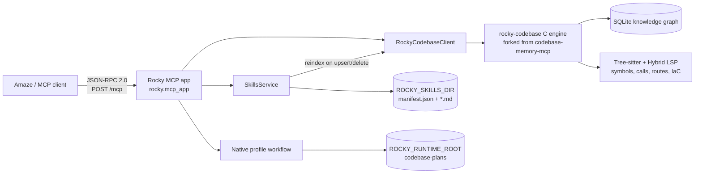

# Rocky

Rocky is a local skills-registry and codebase backend for coding agents. It combines:

- a spec-compliant streamable-HTTP MCP server at `POST /mcp`;
- a managed skills registry stored as Markdown files;
- a forked `rocky-codebase` C engine based on [DeusData/codebase-memory-mcp](https://github.com/DeusData/codebase-memory-mcp);
- a bounded native profile-plan API for precise code reads.

The fork is intentional. `codebase-memory-mcp` is excellent at fast structural code intelligence. Rocky changes the product shape from a standalone analyzer into an Amaze-ready service for **skill storage + codebase tools**: one endpoint for repository structure, operational runbooks, project conventions, debugging recipes, and reusable agent skills.

## Why Rocky exists

Coding agents waste context when they rediscover a repository by grep/read loops or re-learn operational procedures from old transcripts. Rocky gives them a durable local code graph and skill registry instead:

- **Code graph first** — codebase queries return symbols, callers, routes, packages, and snippets instead of raw file floods.
- **Skills as storage** — reusable procedures live as versioned Markdown skills under `ROCKY_SKILLS_DIR`, not pasted into every session.
- **Bounded reads** — profile plans return selected read points plus expansion handles, keeping context focused.
- **Amaze integration** — checked-in `.mcp.json`, `rocky-skills` server name, bearer auth, launchd/container paths, and `mcp__rocky_skills_*` tools are first-class.
- **Local-first operation** — repository understanding stays on the machine; no cloud dependency for indexing or skill lookup.

Upstream codebase-memory-mcp reports 10× fewer tokens in its paper evaluation and a concrete benchmark of ~3,400 tokens for five structural queries versus ~412,000 tokens for file-by-file search. Rocky keeps that token-saving codebase core and adds managed skill storage plus operational APIs around it.

## Architecture



### Runtime surfaces

| Surface | Path | Purpose |
| --- | --- | --- |
| MCP | `POST /mcp` | JSON-RPC initialize, tools/list, tools/call, ping. |
| MCP GET | `GET /mcp` | Returns `405`; Rocky does not push server-initiated SSE. |
| Health | `GET /healthz` | Lightweight MCP app readiness probe. |
| Native profiles | `/v1/codebase/*` | Bounded plan/read/validate/expand workflow not yet exposed as MCP tools. |

### Tool catalog

Rocky MCP exposes local skill tools plus proxied codebase tools:

- Skill tools: `skill_search`, `skill_get`, `skill_upsert`, `skill_delete`, `skill_list`.
- Codebase tools: loaded from the `rocky-codebase` engine, including `index_repository`, `detect_changes`, `index_status`, `search_graph`, `search_code`, `get_code_snippet`, `trace_path`, `get_architecture`, and `query_graph`.

Unknown tools are returned as MCP tool errors instead of crashing the server. `resources/list`, `resources/templates/list`, and `prompts/list` return empty lists because Rocky is tool-only.

## Skill registry storage

Skills are durable local files:

```text
ROCKY_SKILLS_DIR/
  manifest.json
  <skill-name>.md
```

Each skill file has YAML frontmatter and a Markdown body:

```markdown
---
name: rocky-example
summary: When to use this skill
tags:
  - rocky
version: 1
---
Procedure, caveats, commands, verification notes.
```

Storage behavior:

- `skill_upsert` sanitizes the kebab-case name, writes `<name>.md`, updates `manifest.json`, increments `version`, and triggers a small reindex of the skills directory.
- `skill_search` asks the codebase graph first, then falls back to manifest substring/token matching if the C engine is unavailable.
- `skill_get` loads the full Markdown body only when needed.
- `skill_delete` removes the file and manifest entry.

This is Rocky's main product difference from a plain code analyzer: agent procedures that used to live in one transcript become searchable local knowledge for future sessions.

## Quick start

```bash
cd /Users/steve/amaze_s3/rocky
uv sync
ROCKY_RUNTIME_ROOT=$PWD/.rocky \
ROCKY_API_KEY=rocky-secret \
uvicorn rocky.mcp_app:app --host 127.0.0.1 --port 7777
```

Equivalent CLI:

```bash
uv run rocky serve --host 127.0.0.1 --port 7777 --api-key rocky-secret
```

`bin/rocky-codebase` is a launcher, not a maintainer-local symlink. On macOS arm64 it materializes the bundled compressed C-engine archive (`bin/rocky-codebase.darwin-arm64.xz`) into `.rocky/bin/` on first use, then execs it. Set `ROCKY_CODEBASE_BINARY` only when you want to use a different engine build.

Default local runtime:

```text
host: 127.0.0.1
port: 7777
mcp endpoint: /mcp
auth: Authorization: Bearer rocky-secret
skills dir: ~/.rocky/skills unless ROCKY_SKILLS_DIR is set
runtime root: ~/.rocky unless ROCKY_RUNTIME_ROOT is set
codebase backend: ./bin/rocky-codebase launcher unless ROCKY_CODEBASE_BINARY is set
```

## Amaze integration

This repository includes `.mcp.json` so Amaze can discover Rocky from the workspace:

```json
{
  "mcpServers": {
    "rocky-skills": {
      "type": "http",
      "url": "http://localhost:7777/mcp",
      "headers": {
        "Authorization": "Bearer rocky-secret"
      }
    }
  }
}
```

Amaze namespaces remote tools with the `mcp__rocky_skills_*` prefix.

If Rocky runs from the Apple container helper rather than localhost, run:

```bash
bin/rocky-mcp-up.sh
```

The helper starts or reuses the `rocky-mcp` container, waits for MCP initialize to succeed, then rewrites the target Amaze `.mcp.json` URL to the container's current VM IP.

## Configuration

| Variable | Default | Meaning |
| --- | --- | --- |
| `ROCKY_HOST` | `127.0.0.1` | Host used by `rocky serve`. |
| `ROCKY_PORT` | `7777` | Port used by `rocky serve`. |
| `ROCKY_API_KEY` | unset | When set, clients must send `Authorization: Bearer <key>`. |
| `ROCKY_SKILLS_DIR` | `~/.rocky/skills` | Skill registry directory. |
| `ROCKY_RUNTIME_ROOT` | `~/.rocky` | Native profile plan storage root. |
| `ROCKY_CODEBASE_ENABLED` | `true` | Enables codebase tools. |
| `ROCKY_CODEBASE_AUTO_INDEX` | `true` | Allows automatic indexing before profile/search workflows. |
| `ROCKY_CODEBASE_BINARY` | `<rocky repo>/bin/rocky-codebase` | Local C-engine launcher or binary path. |
| `ROCKY_CODEBASE_ENDPOINT` | unset | Optional remote `/rpc` backend for the C engine. |
| `ROCKY_CODEBASE_PROJECT_PATH` | `.` | Default repository for native profile workflows. |
| `ROCKY_CODEBASE_TIMEOUT_SECONDS` | `30` | C-engine call timeout. |
| `ROCKY_CODEBASE_STALE_AFTER_SECONDS` | `300` | Index freshness window. |

## Operator checks

Health:

```bash
curl http://127.0.0.1:7777/healthz
```

MCP initialize:

```bash
curl -s http://127.0.0.1:7777/mcp \
  -H 'Authorization: Bearer rocky-secret' \
  -H 'Content-Type: application/json' \
  -H 'Accept: application/json, text/event-stream' \
  -d '{"jsonrpc":"2.0","id":1,"method":"initialize","params":{"protocolVersion":"2025-06-18","capabilities":{},"clientInfo":{"name":"agent","version":"0"}}}'
```

MCP tools:

```bash
curl -s http://127.0.0.1:7777/mcp \
  -H 'Authorization: Bearer rocky-secret' \
  -H 'Content-Type: application/json' \
  -H 'Accept: application/json, text/event-stream' \
  -d '{"jsonrpc":"2.0","id":2,"method":"tools/list","params":{}}'
```

Native profile health:

```bash
curl http://127.0.0.1:7777/v1/codebase/health
```

## Native profile API

The native HTTP surface is deliberately small. Raw indexing/search wrappers were removed in favor of MCP `tools/call`; native HTTP keeps only the bounded profile-plan workflow.

| Endpoint | Purpose |
| --- | --- |
| `GET /v1/codebase/status` | Codebase backend configuration and availability. |
| `GET /v1/codebase/profiles` | Available bounded-context profiles. |
| `GET /v1/codebase/health` | Profile-engine collector health. |
| `POST /v1/codebase/plan` | Build a bounded codebase read plan. |
| `GET /v1/codebase/plan/{plan_id}` | Read a stored plan. |
| `DELETE /v1/codebase/plan/{plan_id}` | Delete a stored plan. |
| `POST /v1/codebase/read` | Read selected plan points. |
| `POST /v1/codebase/validate_points` | Validate selected point freshness. |
| `POST /v1/codebase/expand` | Expand a deferred plan cluster. |

Removed surfaces include LLM/OpenAI-style routes, legacy `/v1/search` and `/v1/context/build`, raw `/v1/codebase/index|search_graph|search_code|call`, and duplicate `/v1/rocky/codebase/*` aliases.

## Deployment notes

### launchd

`launchd/dev.rocky.llm.plist` runs:

```text
/Users/steve/amaze_s3/rocky/.venv/bin/rocky serve
```

with `ROCKY_PORT=7777`, `ROCKY_RUNTIME_ROOT=/Users/steve/amaze_s3/rocky/.rocky`, `ROCKY_CODEBASE_BINARY=/Users/steve/amaze_s3/rocky/bin/rocky-codebase`, `ROCKY_CODEBASE_PROJECT_PATH=/Users/steve/amaze_s3/amaze`, and `ROCKY_API_KEY=rocky-secret`. The `bin/rocky-codebase` launcher expands the bundled Darwin arm64 engine into `.rocky/bin/` if needed.

Logs go to:

```text
/Users/steve/amaze_s3/rocky/.rocky/logs/rocky-llm.out.log
/Users/steve/amaze_s3/rocky/.rocky/logs/rocky-llm.err.log
```

### Container

`deploy/mcp/Containerfile.full` builds an ML-free Python runtime plus the native `rocky-codebase` binary. It sets:

```text
ROCKY_SKILLS_DIR=/skills
ROCKY_CODEBASE_BINARY=/usr/local/bin/rocky-codebase
ROCKY_HOST=0.0.0.0
ROCKY_PORT=7777
```

The image imports `rocky.mcp_app` during build and fails if heavy ML modules (`mlx`, `torch`, `transformers`, etc.) leak into the MCP path.

## Validation

Focused tests:

```bash
python3 -m pytest \
  tests/test_mcp_server.py \
  tests/test_codebase_tools_list.py \
  tests/test_native_search_flow.py \
  tests/test_profile_engine_stage.py \
  tests/test_codebase_call_passthrough.py \
  tests/test_skills_service.py
```

Live surface check:

```bash
python3 scripts/random_live_surface_check.py
```

Compile changed modules:

```bash
python3 -m py_compile \
  rocky/mcp_app.py \
  rocky/core/routes/rocky_native.py \
  rocky/core/routes/mcp_server.py \
  rocky/search/*.py \
  rocky/skills/*.py \
  scripts/random_live_surface_check.py
```

## License and attribution

Rocky is MIT licensed; see [`LICENSE`](LICENSE).

The embedded `rocky-codebase` engine is forked from [DeusData/codebase-memory-mcp](https://github.com/DeusData/codebase-memory-mcp), also MIT licensed. The upstream notice is preserved at [`vendor/codebase-memory-mcp/LICENSE`](vendor/codebase-memory-mcp/LICENSE), and vendored third-party provenance is preserved at [`vendor/codebase-memory-mcp/THIRD_PARTY.md`](vendor/codebase-memory-mcp/THIRD_PARTY.md).

Keep the MIT notices, upstream attribution, and third-party notices with any redistributed engine build.

## Development notes

- Keep deployable source in `rocky/`, `scripts/`, `deploy/`, `launchd/`, and `tests/`.
- Do not commit `.harness/`, virtualenvs, pycache, local logs, pid files, or runtime stores.
- Prefer `uvicorn rocky.mcp_app:app` or `uv run rocky serve` for the MCP-only runtime.
