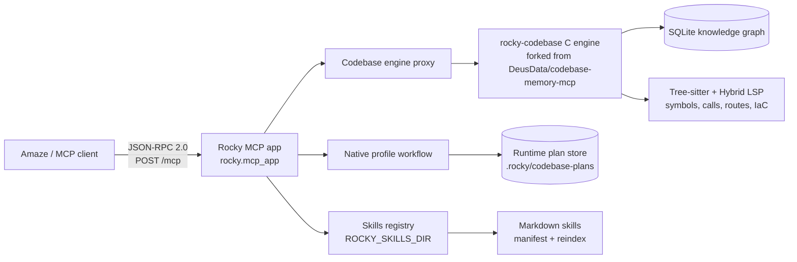

# Rocky

Rocky is a lightweight local backend for agent-facing **skills** and **codebase** tools. It packages a Python MCP control plane with a high-performance C codebase engine forked from [DeusData/codebase-memory-mcp](https://github.com/DeusData/codebase-memory-mcp).

The primary surface is a spec-compliant streamable-HTTP MCP endpoint at `POST /mcp`. It serves reusable Markdown skills plus Rocky codebase tools backed by the `rocky-codebase` C engine. The native HTTP API is intentionally narrow and only keeps the bounded profile-plan workflow that is not currently exposed by the MCP tool catalog.

Rocky's pitch is simple: give coding agents a memory-shaped code graph instead of forcing them to rediscover the repository by opening hundreds of files. The upstream engine reports 10× fewer tokens in its paper evaluation and a concrete benchmark of ~3,400 tokens for five structural queries versus ~412,000 tokens for file-by-file search. Rocky keeps that token-saving graph core, then adds an Amaze-ready MCP server, managed skills, bounded read plans, auth, launchd/container deployment paths, and local-first operation.

What Rocky adds on top of the fork is the part built for daily agent work: one local endpoint for skills and code intelligence, no cloud dependency for repository understanding, no forced full-context dumps, and a small enough operational surface to run from launchd, uvicorn, or a local container. It is intentionally boring to operate and aggressive about saving tokens.

## Quick start

```bash
cd /Users/steve/amaze_s3/rocky
uv sync
ROCKY_RUNTIME_ROOT=$PWD/.rocky \
ROCKY_API_KEY=rocky-secret \
uvicorn rocky.mcp_app:app --host 127.0.0.1 --port 7777
```

Default local MCP runtime:

```text
host: 127.0.0.1
port: 7777
mcp endpoint: /mcp
auth: Authorization: Bearer rocky-secret
codebase backend: /Users/steve/amaze_s3/rocky/bin/rocky-codebase
skills dir: ~/.rocky/skills unless ROCKY_SKILLS_DIR is set
logs: /Users/steve/amaze_s3/rocky/.rocky/logs
```

## Installation

```bash
cd /Users/steve/amaze_s3/rocky
uv sync
```

For the local Amaze integration, keep this repository's checked-in `.mcp.json` in place. It registers Rocky as the `rocky-skills` HTTP MCP server:

```json
{
  "mcpServers": {
    "rocky-skills": {
      "type": "http",
      "url": "http://localhost:7777/mcp",
      "headers": {
        "Authorization": "Bearer rocky-secret"
      }
    }
  }
}
```

Amaze discovers `.mcp.json` from the active workspace and exposes Rocky tools with the `mcp__rocky_skills_*` prefix. If you run Rocky from the Apple container helper instead of localhost, run `bin/rocky-mcp-up.sh`; it starts the `rocky-mcp` container and rewrites the target Amaze `.mcp.json` URL to the container's current VM IP.

## Operator checks

MCP readiness:

```bash
curl http://127.0.0.1:7777/healthz
```

MCP tool catalog:

```bash
curl -s http://127.0.0.1:7777/mcp \
  -H 'Authorization: Bearer rocky-secret' \
  -H 'Content-Type: application/json' \
  -H 'Accept: application/json, text/event-stream' \
  -d '{"jsonrpc":"2.0","id":1,"method":"tools/list","params":{}}'
```

Codebase profile health:

```bash
curl http://127.0.0.1:7777/v1/codebase/health
```

## MCP server

- **Endpoint**: `POST /mcp` (JSON-RPC 2.0, single object or batch). `GET /mcp` returns `405`.
- **Auth**: `Authorization: Bearer $ROCKY_API_KEY` when a key is configured; open otherwise.
- **Skill tools**: `skill_search`, `skill_get`, `skill_upsert`, `skill_delete`, `skill_list`. Search/list responses are lightweight (`name`, `summary`, `tags`, `version`, plus `score` for search); full Markdown bodies are returned only by `skill_get`.
- **Codebase tools**: proxied from the C engine, including `index_repository`, `detect_changes`, `index_status`, `search_graph`, `search_code`, `get_code_snippet`, `trace_path`, `get_architecture`, `query_graph`, and related tools.
- **Index control plane**: indexing is kept as MCP tools. Agents should call `index_repository`, `detect_changes`, and `index_status` through MCP rather than native HTTP aliases.
- **Skills store**: Markdown skill files under `ROCKY_SKILLS_DIR` (default `~/.rocky/skills`). `skill_upsert` writes frontmatter plus body and reindexes the skills directory.

Example initialize request:

```bash
curl -s http://127.0.0.1:7777/mcp \
  -H 'Authorization: Bearer rocky-secret' \
  -H 'Content-Type: application/json' \
  -H 'Accept: application/json, text/event-stream' \
  -d '{"jsonrpc":"2.0","id":1,"method":"initialize","params":{"protocolVersion":"2025-06-18","capabilities":{},"clientInfo":{"name":"agent","version":"0"}}}'
```

## Token efficiency

Rocky reduces context spend by answering repository questions from a prebuilt structural graph:

- `search_graph`, `trace_path`, `get_architecture`, and `query_graph` return ranked symbols, callers, routes, dependencies, and package clusters instead of raw file floods.
- Profile plans return bounded read points plus expansion handles, so agents inspect only the lines needed for the task.
- Skill search returns lightweight metadata first; full Markdown bodies are loaded only on `skill_get`.
- The forked codebase engine inherits upstream codebase-memory-mcp's measured savings: five structural queries at ~3,400 tokens versus ~412,000 tokens through file-by-file exploration, about a 120× reduction for that scenario.

The practical effect for Amaze: fewer repeated grep/read loops, lower prompt pressure, and more room for task-specific reasoning and verification.

## Native API

The native HTTP surface is intentionally limited to Rocky's profile-plan workflow and profile diagnostics:

| Endpoint | Purpose |
| --- | --- |
| `GET /v1/codebase/status` | Reports Rocky codebase backend configuration and availability. |
| `GET /v1/codebase/profiles` | Lists available bounded context profiles. |
| `GET /v1/codebase/health` | Reports profile-engine collector health. |
| `POST /v1/codebase/plan` | Builds a bounded codebase read plan. |
| `GET /v1/codebase/plan/{plan_id}` | Reads a stored plan. |
| `DELETE /v1/codebase/plan/{plan_id}` | Deletes a stored plan. |
| `POST /v1/codebase/read` | Reads selected plan points. |
| `POST /v1/codebase/validate_points` | Validates selected point freshness. |
| `POST /v1/codebase/expand` | Expands a deferred plan cluster. |

Removed native aliases and wrappers:

- LLM/OpenAI-style routes (`/v1/chat/completions`, `/v1/models`, `/v1/responses`, `/v1/completions`, audio/cache/request routes) are not part of the MCP-only surface.
- Legacy search/context routes (`/v1/search`, `/v1/context/build`) are removed.
- Raw C-engine HTTP wrappers (`/v1/codebase/index`, `/v1/codebase/search_graph`, `/v1/codebase/search_code`, `/v1/codebase/call`) are removed in favor of MCP `tools/call`.
- `/v1/rocky/codebase/*` duplicate aliases are removed.

## Architecture



```text
Agent / MCP client
    |
    | JSON-RPC 2.0 over POST /mcp
    v
Rocky MCP app
    |
    +-- Skills registry
    |     - Markdown skills
    |     - manifest-backed CRUD
    |     - skill_upsert/delete trigger skill-dir reindex
    |
    +-- Codebase engine proxy
    |     - forked from DeusData/codebase-memory-mcp
    |     - index_repository / detect_changes / index_status
    |     - search_graph / search_code
    |     - get_code_snippet / trace_path / architecture/query tools
    |
    +-- Native profile workflow
          - bounded codebase_plan/read/validate/expand endpoints
          - plan ids and fresh-point validation
```

### Design boundaries

- MCP is the canonical agent/tool transport for skills, indexing, and raw codebase operations.
- Native HTTP remains only for the profile-plan workflow that MCP does not yet expose.
- Index functionality must remain available; only duplicate HTTP transport wrappers were removed.
- `rocky.mcp_app` is the lightweight ML-free ASGI entrypoint. It avoids importing the full MLX serving stack.

## Validation

Run the focused test suite:

```bash
python3 -m pytest \
  tests/test_mcp_server.py \
  tests/test_codebase_tools_list.py \
  tests/test_native_search_flow.py \
  tests/test_profile_engine_stage.py \
  tests/test_codebase_call_passthrough.py \
  tests/test_skills_service.py
```

Run the live surface check:

```bash
python3 scripts/random_live_surface_check.py
```

Compile changed modules:

```bash
python3 -m py_compile \
  rocky/mcp_app.py \
  rocky/core/server.py \
  rocky/core/routes/rocky_native.py \
  rocky/core/routes/mcp_server.py \
  rocky/search/*.py \
  rocky/skills/*.py \
  scripts/random_live_surface_check.py
```

## Runtime files

With `ROCKY_RUNTIME_ROOT=/Users/steve/amaze_s3/rocky/.rocky`, Rocky stores profile plans under:

```text
/Users/steve/amaze_s3/rocky/.rocky/codebase-plans
```

The checked-in launchd plists in `launchd/` send service logs to:

```text
/Users/steve/amaze_s3/rocky/.rocky/logs
```

## License and upstream attribution

Rocky is released under the MIT License; see [`LICENSE`](LICENSE).

The embedded `rocky-codebase` engine is forked from [DeusData/codebase-memory-mcp](https://github.com/DeusData/codebase-memory-mcp), which is also MIT-licensed. Rocky preserves the upstream license at [`vendor/codebase-memory-mcp/LICENSE`](vendor/codebase-memory-mcp/LICENSE) and third-party provenance at [`vendor/codebase-memory-mcp/THIRD_PARTY.md`](vendor/codebase-memory-mcp/THIRD_PARTY.md).

In plain terms: keep the MIT notices, keep the upstream attribution, and keep third-party notices with any redistributed engine build.

## Development notes

- Keep deployable source in `rocky/`, `scripts/`, `deploy/`, `launchd/`, and `tests/`.
- Do not commit `.harness/`, virtualenvs, pycache, local logs, pid files, or runtime stores.
- Prefer `uvicorn rocky.mcp_app:app` for the MCP-only runtime.
