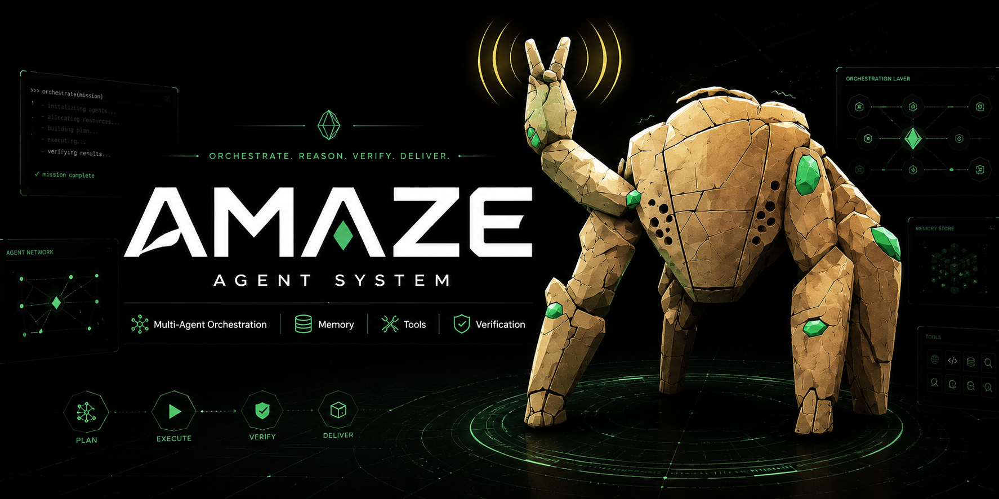

# Amaze

Amaze is a compact, tool-grounded coding-agent runtime for verified repository work. The top-level agent stays small: it owns the goal, plans the work, delegates bounded slices, integrates results, and verifies acceptance criteria. Detailed reading and edits happen in scoped subagents with explicit contracts.

The current system is built around a scout-and-orchestrate architecture: tools and specialized agents gather evidence, a compact orchestrator makes decisions, Mission Control records the work, and proposal/apply/rollback loops make learning and configuration changes auditable.

## What is in this repository

- `packages/coding-agent` — the `amaze` CLI, interactive runtime, tools, goal verifier, task/subagent orchestration, Mission Control, research, proposals, rules, and session plumbing.
- `packages/ai` — provider/model integration and streaming utilities used by the agent runtime.
- `packages/tui` — terminal UI primitives used by interactive mode.
- `packages/agent`, `packages/utils`, `packages/stats`, `packages/natives` — shared runtime, CLI, telemetry, and native helper packages.
- `packages/swarm-extension` and `packages/typescript-edit-benchmark` — extension and benchmark/support packages.
- `python/rocky` — Rocky Python service.
- `.amaze/` — checked-in project settings, skills, commands, and rules used by this repository profile.
- `docs/` — current operator documentation plus historical implementation records. Start with [`docs/README.md`](docs/README.md).

## Installation

Amaze is distributed as source in this monorepo; install it by building locally. The same steps work on macOS and Linux (and Windows via WSL).

### Prerequisites

- **[Bun](https://bun.sh) 1.3.14+** — primary runtime and package manager (pinned via `packageManager` in `package.json`).
- **Rust (nightly)** — required to build the native addon in `packages/natives`. The toolchain is pinned by `rust-toolchain.toml` and installed automatically by `rustup` on first build.
- **Git** — to clone the repository.
- **Node.js 20+** — optional, only for the global tarball install path below.

### Install from source (recommended)

```sh
git clone https://github.com/steve-8000/amaze.git
cd amaze
bun run install:dev   # installs dependencies and links the `amaze` CLI onto your PATH
bun run build:native  # builds the native addon used at runtime
amaze --version
```

`bun run install:dev` runs `bun install` and links the CLI, so you do not need a separate install step.

### Run without linking

To run straight from source without putting `amaze` on your PATH:

```sh
bun run build:native
bun run dev -- --help
```

### Build a standalone binary

```sh
bun run build:native
bun --cwd=packages/coding-agent run build   # outputs packages/coding-agent/dist/amaze
cp packages/coding-agent/dist/amaze ~/.local/bin/amaze   # ensure ~/.local/bin is on your PATH
amaze --version
```

### Global install via packaged tarball

Builds the CLI and installs it globally with npm (requires Node.js/npm):

```sh
bun run amaze:upgrade-local
```

### First run and authentication

Launch the CLI, then authenticate a model provider:

- Run `amaze` and use the `/login` slash command to sign in to a provider over OAuth, **or**
- Export a provider API key before launching (for example `OPENAI_API_KEY`, `ANTHROPIC_API_KEY`, `GEMINI_API_KEY`).

The default model role is `openai-codex/gpt-5.5`. Model routing and provider defaults live in [`.amaze/config.yml`](.amaze/config.yml).

## Core architecture

### Compact orchestrator and bounded subagents

The main agent is optimized to be a low-token orchestrator. It keeps the objective, acceptance criteria, todos, approvals, and integration state in view, then actively delegates non-trivial repository work to the minimal project-approved subagent roster: `Builder`, `Resercher`, and `SRE`. Direct inline work is reserved for answers/explanations and small single-file edits.

Non-trivial subagent work is passed through a structured contract: scope, success criteria, escalation behavior, and output requirements. Scope is enforced at mutation tools, so prompt text is not the only boundary. Contract verification distinguishes hard failures from uncertainty: `onUncertainty: "ask-parent"` lets the parent continue with the subagent output, while blocking contracts still stop on uncertainty.

### Mission Control and Mission Inspector

Mission Control is the operator-facing read model for mission state. The CLI exposes read-only mission views:

```sh
bun run dev -- mission <list|show|stream|lanes|evidence|decision|verify|rollback>
```

The interactive TUI includes a Mission Control view with objective state, lane/evidence summaries, decisions, verification, proposals, and rollback status. Mission Inspector links a mission back to tool traces, artifacts, subagent details, and session files.

### Research, evidence, and decisions

Research work is modeled as lanes and evidence rather than unstructured notes. Mission records can include lane runs, evidence cards, decisions, verification records, related events, and rollback anchors. The `research` and `mission` CLI surfaces are the operator path into that flow.


### Proposal, apply, and rollback loop

Amaze can turn rules, metrics, and objectives into learning proposals. Proposals are explicit records that can be listed, inspected, approved, rejected, diffed, applied, and rolled back.

```sh
bun run dev -- proposals <list|show|approve|reject|apply|rollback|diff>
bun run dev -- evolve <status|preview|proposals|inspect|approve|apply|rollback|simulate|doctor>
```

Settings proposals carry patches and rollback values; skill and rule proposals are applied through the learning apply path with snapshots/anchors where available.

### Local/runtime model routing

Routing is local configuration, not hard-coded documentation. Project defaults live in `.amaze/config.yml`; package-level provider code lives under `packages/ai`; subagent model/thinking overrides are exercised by the task agent tests. The checked-in profile currently uses a compact main context, prompt-cache prefix reuse, project-local skills/rules, and an optional local Resercher role.
Amaze supports a provider-agnostic local LLM scout role for cheap prepasses before expensive remote reasoning. Projects configure this through `modelRoles.Resercher` and `localLlm.*` settings; task routing resolves the role alias instead of depending on a concrete local model name. Bundled `Resercher` prompts use the `Resercher` role with structured outputs when local scouting is enabled, while explicit per-agent overrides and normal fallback routing remain available.

Durable user, project, and prior-decision context is backed by GBrain/Agency Brain via `agencyBrain.*` settings in `.amaze/config.yml`. Legacy local, Mem0, and Hermes memory backends are not supported runtime memory paths.

The local Resercher helpers live under `packages/coding-agent/src/local-llm/` and cover config resolution, conservative evidence-bundle types/validation, stable prompt construction for prefix-cache reuse, local role/config health checks, and cache/token accounting helpers. See `docs/models.md` for configuration examples.

## Commands

Root package scripts are the canonical local entry points:

| Purpose | Command |
| --- | --- |
| Install dependencies | `bun install` |
| Link local development CLI/packages | `bun run install:dev` |
| Run the CLI from source | `bun run dev` |
| Show CLI stats | `bun run stats` |
| Build workspaces | `bun run build` |
| Build native package | `bun run build:native` |
| Typecheck and Biome-check TypeScript workspaces | `bun run check:ts` |
| Full check, including Rust lane | `bun run check` |
| Run TypeScript tests | `bun run test:ts` |
| Rerun failed TypeScript tests | `bun run test:ts:failed` |
| Full tests, including Rust lane | `bun run test` |
| Lint TypeScript and Rust lanes | `bun run lint` |
| Format TypeScript and Rust lanes | `bun run fmt` |
| Mission Control CLI | `bun run dev -- mission list` |
| Proposals CLI | `bun run dev -- proposals list` |

Additional root scripts cover CI release/build jobs, docs-index generation, model generation, Rocky service/docker workflows, Python tests, and session statistics. See `package.json` for the complete list.

## Documentation

Use [`docs/README.md`](docs/README.md) as the canonical docs map. It separates current/operator docs from historical phase records and design/archive material.

Key current docs include:

- [`docs/config-usage.md`](docs/config-usage.md) and [`docs/environment-variables.md`](docs/environment-variables.md) — configuration and environment reference.
- [`docs/session.md`](docs/session.md), [`docs/tui.md`](docs/tui.md), and browser tooling docs — operator/runtime surfaces.
- [`docs/x-search.md`](docs/x-search.md), [`docs/custom-tools.md`](docs/custom-tools.md), [`docs/mcp-config.md`](docs/mcp-config.md), and [`docs/mcp-server-tool-authoring.md`](docs/mcp-server-tool-authoring.md) — tool and integration docs.

Historical implementation records are preserved under `docs/Phase0` through `docs/Phase7` and `docs/analysis`.
